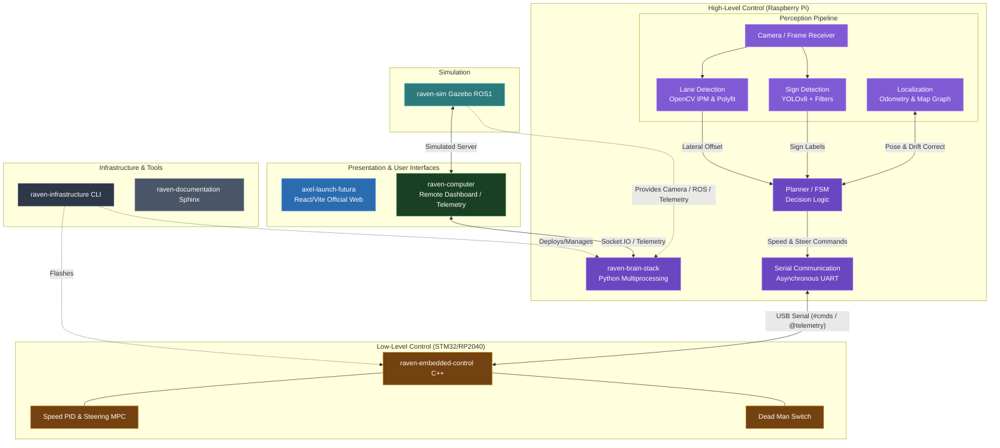

# Skynet Architecture: Modular Map-Based vs End-to-End (E2E)

You've asked a very important and insightful question: **Are we using a Hybrid approach, an E2E approach, or just Map-based?**

Let's clear up the terminology based on exactly what we built in [skynet.py](file:///Users/hatem/University/AXEL/Challenges/25-26/Bosch%20Future%20Mobility%20Challenge/raven-brain-stack/src/skynet.py) and [threadLaneDetection.py](file:///Users/hatem/University/AXEL/Challenges/25-26/Bosch%20Future%20Mobility%20Challenge/raven-brain-stack/src/perception/lane_detection/threadLaneDetection.py).

## What kind of system is Skynet?
Skynet is a **Modular, Map-Based Hybrid Architecture**. 

It is **NOT** a "Pure End-to-End (E2E)" system.

Here is the exact breakdown of what those terms mean in the context of our code:

## 🌍 Global System Architecture



### 1. Why it is NOT "Pure End-to-End (E2E)"
A **Pure E2E** approach operates like a black box:
*   **Input**: Raw Camera Image
*   **Neural Network**: (One giant model processes everything)
*   **Output**: Steering Angle & Speed (e.g., `steer: 15, speed: 20`)

*Why we didn't do this:* E2E systems are notoriously difficult to debug. If the car crashes, you don't know if the network failed to see the lane, or if it failed to understand the steering physics. They also cannot easily follow complex navigation routes on a map without massive amounts of training data.

### 2. Why it is "Hybrid Perception" (Deep Learning + Classical CV)
Instead of one massive neural network, we split the brain into specialized, understandable pieces. This is called a **Modular Pipeline**. It is "hybrid" because we use two completely different types of computer vision simultaneously:

*   **Deep Learning (YOLOv8)**: We use AI *only* for the things AI is best at—detecting complex objects like Stop Signs, Crosswalks, and other cars. (Runs in [PerceptionThread](file:///Users/hatem/University/AXEL/Challenges/25-26/Bosch%20Future%20Mobility%20Challenge/raven-brain-stack/src/skynet.py#230-420)).
*   **Classical Computer Vision (OpenCV)**: We use deterministic math for the things math is best at—finding the road lines. In [threadLaneDetection.py](file:///Users/hatem/University/AXEL/Challenges/25-26/Bosch%20Future%20Mobility%20Challenge/raven-brain-stack/src/perception/lane_detection/threadLaneDetection.py), we use Inverse Perspective Mapping (IPM) to look at the road from a top-down view, filter for the white/yellow color, and mathematically fit a polynomial curve to the pixels. 

*Why this is better:* If the car swerves off the road, we know *exactly* why. We can look at the OpenCV output and see if the mathematical curve fit failed.

### 3. Why it is "Map-Based"
The car doesn't just react to what's directly in front of it; it tracks its position in the world.

*   **Odometry & The Start Pose**: When we run `raven calibrate --x 120 --y 80`, we tell the car where it is on the `current_track.png` map.
*   **Dead Reckoning**: As the car drives, the IMU ([threadOdometry.py](file:///Users/hatem/University/AXEL/Challenges/25-26/Bosch%20Future%20Mobility%20Challenge/raven-brain-stack/src/perception/odometry/threadOdometry.py)) updates the [(X, Y)](file:///Users/hatem/University/AXEL/Challenges/25-26/Bosch%20Future%20Mobility%20Challenge/raven-brain-stack/src/skynet.py#493-526) coordinates.
*   **Landmark Correction**: Because wheels slip, IMU math drifts over time. When YOLO sees a "Stop Sign," the system checks the map. The map says "There is a Stop Sign at X=200, Y=150." The car now knows *exactly* where it is and corrects its internal [(X,Y)](file:///Users/hatem/University/AXEL/Challenges/25-26/Bosch%20Future%20Mobility%20Challenge/raven-brain-stack/src/skynet.py#493-526) drift.

### 4. The "Skynet" Planner (The Decision Maker)
The core of [skynet.py](file:///Users/hatem/University/AXEL/Challenges/25-26/Bosch%20Future%20Mobility%20Challenge/raven-brain-stack/src/skynet.py) is the [PlannerThread](file:///Users/hatem/University/AXEL/Challenges/25-26/Bosch%20Future%20Mobility%20Challenge/raven-brain-stack/src/skynet.py#426-474). It acts as the brain that takes the outputs from all the different modules and makes a safe, deterministic decision.

**The Logic Flow in Skynet:**
1.  **Lane Detection** says: "The center of the road is 5cm to the right." ➡️ Planner sends `steer: +12` to Arduino.
2.  **YOLO** says: "I see a Stop Sign."
3.  **Localization** says: "According to the map and our speed, we will reach the intersection line in 1.5 seconds."
4.  **Planner** decides: "Brake to 0 cm/s for 3 seconds, then check map for next route."

### Summary Conclusion
You do not have a black-box E2E system. You have built a highly deterministic, professional-grade **Modular Map-Based system with Hybrid Perception**. This is the same architectural style used by modern autonomous companies like Waymo and Cruise, because every single decision the car makes can be logged, audited, and mathematically tuned.

---

## Building the Map Graph (`map_waypoints.json`)

To make the Localization thread work, the car needs to know real-world distances (in centimeters) between signs and intersections. We use a custom interactive Python tool to generate this data from a digital track map image.

### 1. The Map Image File
Yes, you only need to upload the image file of the track.
- **Format:** It must be a standard raster image (`.png` or `.jpg`). If you have an `.svg` CAD file, export it as a high-resolution `.png`.
- **Perspective:** It must be **strictly from above (Top-Down / Orthographic view)**, without any 3D perspective distortion or angling. A digital 2D render (like the standard BFMC track map) is perfect.

### 2. Running the Map Builder Tool
Once you have your `track.png` saved on your computer, run the interactive OpenCV Map Builder script from your Mac terminal:

```bash
cd raven-brain-stack
python3 src/perception/localization/build_map_graph.py path/to/your/track.png
```

### 3. Step-by-Step UI Instructions
When the UI window opens, follow the on-screen prompts:

1. **Step 1 & 2: Define Scale:** 
   - Click two points on the map where you know the exact real-world distance (For example, click the left side of a city lane, then the right side).
   - The terminal will ask you for the real-world distance in centimeters. Type `35` (or whatever the known distance is) and press enter. 
   - *This permanently calibrates the pixel-to-centimeter scale for the rest of the map.*
2. **Step 3: Set Origin (0,0):**
   - Click the exact spot on the physical Start Line where the robot boots up. This becomes `X=0, Y=0`.
3. **Step 4: Map the Landmarks (Waypoints):**
   - Hover your mouse over where a sign is physically located on the track.
   - Press the corresponding key on your keyboard to select the sign type:
     - `c` = Crosswalk
     - `s` = Stop Sign
     - `r` = Roundabout
     - `h` = Highway Entrance
     - `p` = Parking
     - `y` = Priority Sign
   - **Click** to drop the waypoint. (Press `z` if you make a mistake and need to undo).
4. **Step 5: Save and Export:**
   - Press `q` to quit the window.
   - The script will automatically generate a highly accurate, scaled `map_waypoints.json` file in your current directory.
5. **Finalize:**
   - Move the generated `map_waypoints.json` into `src/perception/localization/map_waypoints.json`. 
   - The `threadLocalization.py` will automatically read it the next time you boot Skynet!
