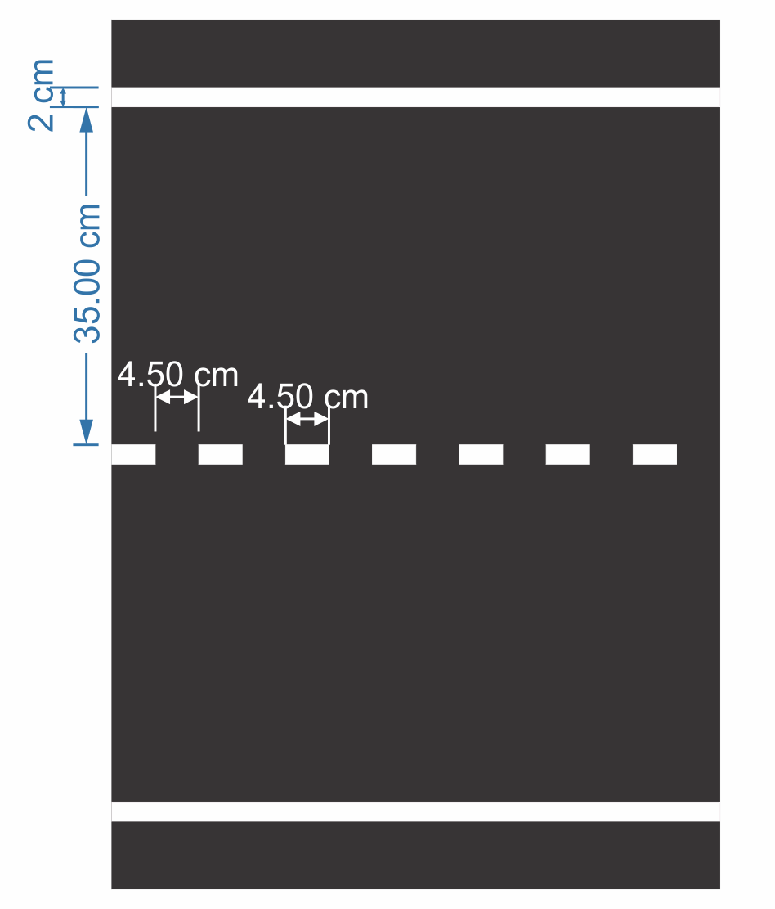
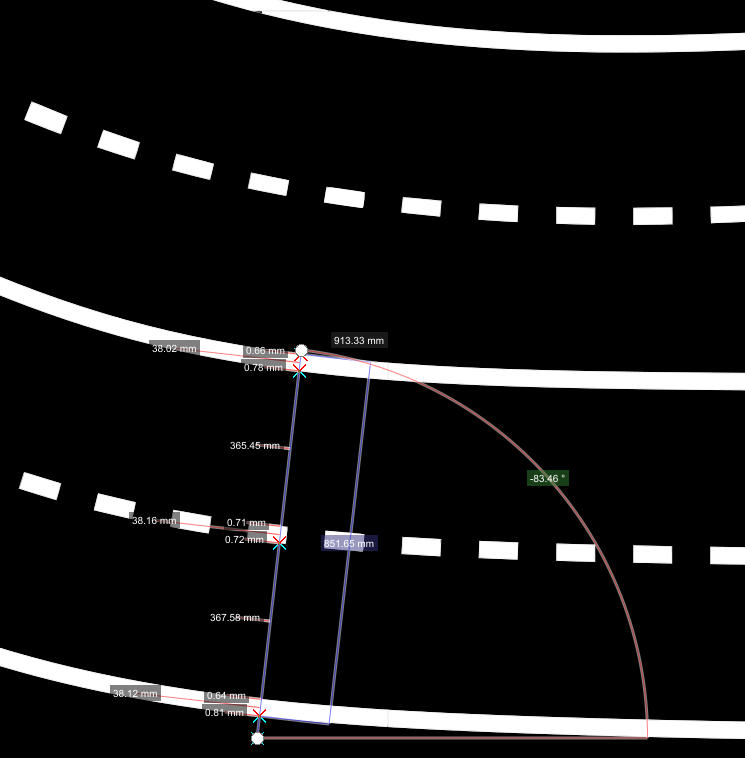
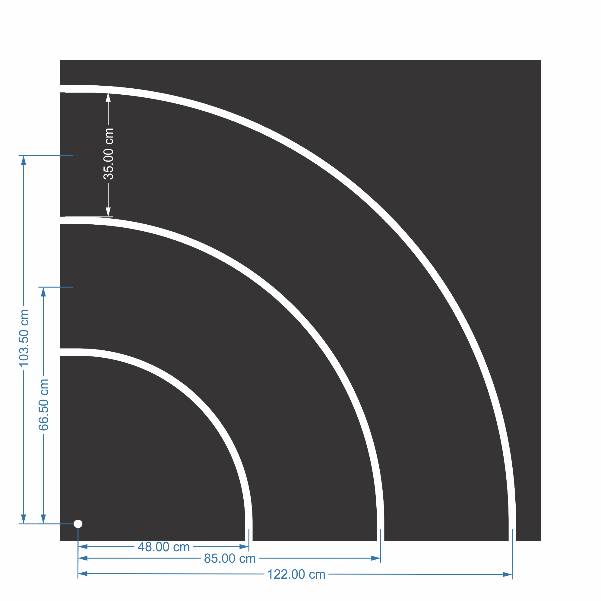
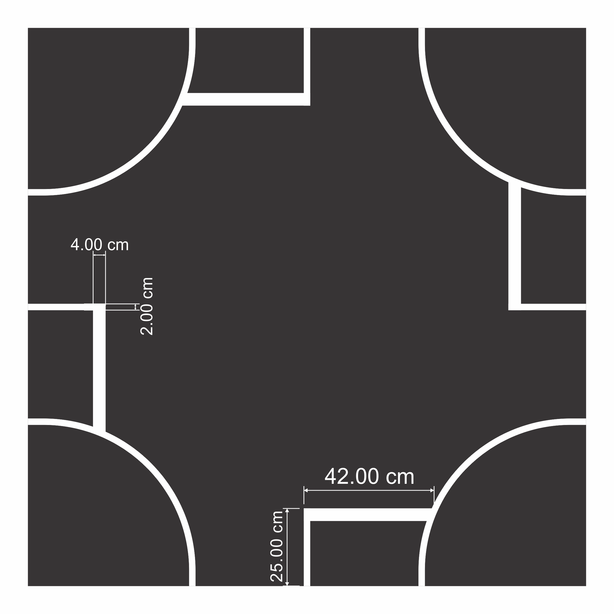
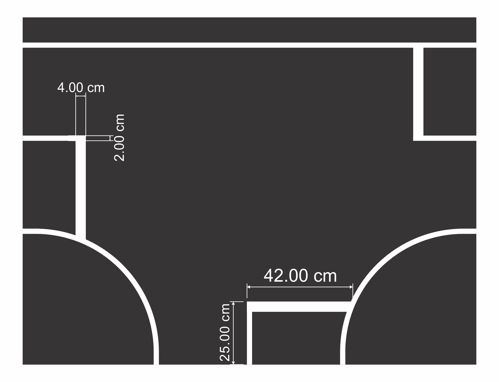
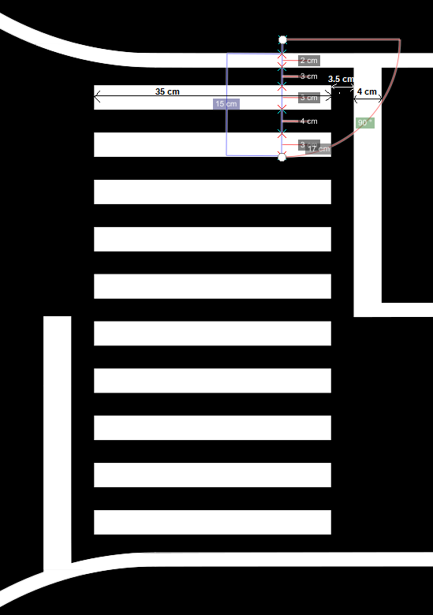
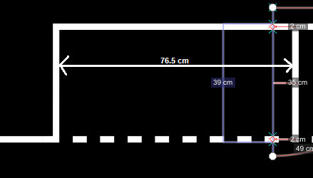
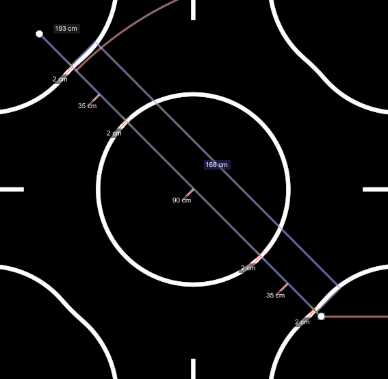
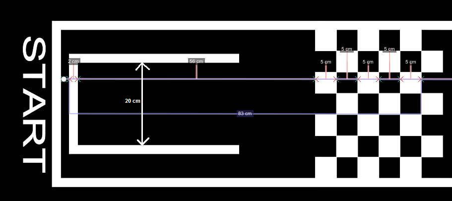

Road Markings
=============

The lane markings may be **dashed or continuous** and use a **~2 cm wide white line**.  
For dashed lane markings:

- Dash length: **4.5 cm**
- Gap length: **4.5 cm**

The lane width is **~35 cm**, measured from the **inner edges** of the respective markings.

.. list-table:: City Road — Measured Dimensions
   :widths: 40 60
   :header-rows: 1

   * - Parameter
     - Value
   * - Lane width
     - **35 cm** (inner edge to inner edge)
   * - Line width
     - **2 cm**
   * - Dash length
     - **4.5 cm**
   * - Gap length
     - **4.5 cm**

Highway Markings
----------------

On the highway section:

- Lane width: **~37 cm**
- Line width: **4 cm**
- Dashed pattern: **9 cm on / 9 cm off**

.. list-table:: Highway — Measured Dimensions
   :widths: 40 60
   :header-rows: 1

   * - Parameter
     - Value
   * - Lane width
     - **37 cm**
   * - Line width
     - **4 cm**
   * - Dash on
     - **9 cm**
   * - Dash off
     - **9 cm**

Curves and Intersections
------------------------

The following image shows the **tightest curve** on the track (also the most frequent curve type):

.. list-table:: Tightest Curve — Measured Dimensions
   :widths: 40 60
   :header-rows: 1

   * - Parameter
     - Value
   * - Outer lane radius
     - **~913 mm** outer / **~852 mm** outer (dual carriageway)
   * - Lane spacing (dual carriageway)
     - **~366 mm**
   * - Inner wall offset
     - **~38 mm**
   * - Curve angle
     - **~83°**

Below are the main types of **intersections**.  
More variations exist on the track, but their dimensions are largely similar.

.. list-table:: Intersection — Measured Dimensions
   :widths: 40 60
   :header-rows: 1

   * - Parameter
     - Value
   * - Outer line width
     - **4 cm**
   * - Inner marking width
     - **2 cm**
   * - Stop box width
     - **42 cm**
   * - Stop box depth
     - **25 cm**

Crosswalk Dimensions
--------------------

Dimensions for crosswalk signalization (also valid for 1-lane crosswalks):

.. list-table:: Crosswalk — Measured Dimensions
   :widths: 40 60
   :header-rows: 1

   * - Parameter
     - Value
   * - Total width (across lane)
     - **35 cm**
   * - Stripe width
     - **~3.5 cm on / 3.5 cm off**
   * - Sign board
     - 6 cm × 6 cm on **205 mm post** (fixed position per rules)

Parking Spot Dimensions
-----------------------

.. list-table:: Parking — Measured Dimensions
   :widths: 40 60
   :header-rows: 1

   * - Parameter
     - Value
   * - Total width (2 bays + markings)
     - **76.5 cm**
   * - Bay A width
     - **39 cm**
   * - Bay B width
     - **35 cm**
   * - Bay depth
     - **~49 cm**
   * - Line width
     - **2 cm**

Roundabout Dimensions
---------------------

.. list-table:: Roundabout — Measured Dimensions
   :widths: 40 60
   :header-rows: 1

   * - Parameter
     - Value
   * - Outer diagonal
     - **193 cm**
   * - Inner circle diameter
     - **168 cm**
   * - Inner island radius
     - **90 cm**
   * - Lane width
     - **35 cm** (standard)
   * - Line markings
     - 2 cm inner / 35 cm lane / 2 cm outer

Starting Point
--------------

The starting point consists of an **incomplete rectangle**:

- Width: **20 cm** (equal to the vehicle width)
- Positioned **56 cm** before the chessboard print

The chessboard is a **7×6 grid of 5 cm squares**, spanning the full lane width.

It can be used for **automatic camera calibration** at the start of the run.

.. list-table:: Starting Point — Measured Dimensions
   :widths: 40 60
   :header-rows: 1

   * - Parameter
     - Value
   * - Rectangle width
     - **20 cm** (vehicle width)
   * - Distance to chessboard
     - **56 cm**
   * - Chessboard grid
     - **7×6** squares of **5 cm** each
   * - Chessboard purpose
     - Automatic camera calibration at race start

Traffic Sign Physical Dimensions
---------------------------------

These dimensions apply to all BFMC signs. Signs are fixed at known positions per the competition rules.

.. list-table:: Sign — Physical Dimensions
   :widths: 40 60
   :header-rows: 1

   * - Parameter
     - Value
   * - Sign bounding box (YOLO detection)
     - **6 cm × 6 cm**
   * - Post height (without sign)
     - **~185 mm**
   * - Post height (with sign)
     - **~205 mm**

.. note::

   All sign positions are fixed and will not change between runs:
   start semaphore, parking signs, traffic lights at intersections,
   roundabout signs, highway entry/exit signs, and crosswalk signs.
   This makes sign detections reliable **landmark events** for map localization.

Highway Markings
----------------

On the highway section:

- Lane width: **~37 cm**
- Line width: **4 cm**
- Dashed pattern: **9 cm on / 9 cm off**

Curves and Intersections
------------------------

The following image shows the **tightest curve** on the track (also the most frequent curve type):

Below are the main types of **intersections**.  
More variations exist on the track, but their dimensions are largely similar.

Crosswalk Dimensions
--------------------

Dimensions for crosswalk signalization (also valid for 1-lane crosswalks):

Parking Spot Dimensions
-----------------------

Roundabout Dimensions
---------------------

Starting Point
--------------

The starting point consists of an **incomplete rectangle**:

- Width: **20 cm** (equal to the vehicle width)
- Positioned **56 cm** before the chessboard print

The chessboard is a **7×6 grid of 5 cm squares**, spanning the full lane width.

It can be used for **automatic camera calibration** at the start of the run.

